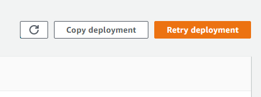

# BlueGreen Pipeline Project

## run below commands

1. npm install
2. npm run build
3. cdk deploy MyCdkStack
4. python ./update_cd.py (If you need to install boto3, try this. => pip install boto3)
5. bash ./push_repo.sh (If you need to install git-remote-codecommit, try this. => pip install git-remote-codecommit)

## check retry deployments after pipline executed
